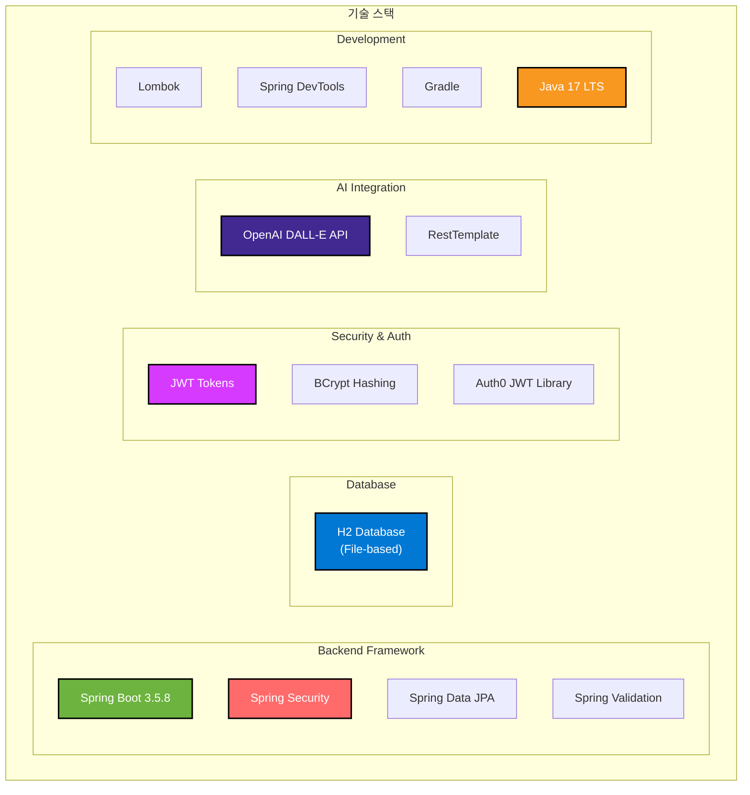

<div align="center">

# BMS Backend - Book Management System

### AI 기반 책 표지 자동 생성 기능을 갖춘 도서 관리 시스템 백엔드

[](https://spring.io/projects/spring-boot)
[](https://www.oracle.com/java/)
[](https://openai.com/)
[](https://www.h2database.com/)

</div>

---

## 프로젝트 소개

BMS(Book Management System)는 사용자가 읽은 책을 효율적으로 관리하고, **OpenAI DALL-E API**를 활용하여 책 표지를 자동으로 생성할 수 있는 도서 관리 시스템입니다.

### 핵심 기능
-  **AI 기반 표지 생성** - DALL-E API로 책 표지 자동 생성
-  **JWT 인증** - 안전한 사용자 데이터 관리
-  **도서 관리** - CRUD 기반 책 관리

---

##  주요 기능

### 사용자 인증 및 관리
- 회원가입 / 로그인 (JWT 기반)
- 비밀번호 암호화 (BCrypt)
- 토큰 기반 세션리스 인증

### 도서 관리 (CRUD)
- 책 등록, 조회, 수정, 삭제
- 사용자별 책 목록 관리
- 권한 기반 접근 제어

### AI 표지 생성
- OpenAI DALL-E API 연동
- 책 제목 + 저자 기반 프롬프트 자동 생성
- 생성된 이미지 자동 다운로드 및 로컬 저장

---

##  기술 스택



### Backend Framework
- **Spring Boot 3.5.8** - 애플리케이션 프레임워크
- **Spring Security** - 인증/인가
- **Spring Data JPA** - ORM 및 데이터베이스 접근
- **Spring Validation** - 입력 검증

### Database
- **H2 Database** - 경량 관계형 데이터베이스 (파일 기반)
  - 개발: 인메모리 모드
  - 운영: 파일 기반 영구 저장

### Security & Authentication
- **JWT (JSON Web Token)** - 토큰 기반 인증
- **Auth0 Java JWT 4.4.0** - JWT 라이브러리
- **BCrypt** - 비밀번호 암호화

### AI & Integration
- **OpenAI DALL-E API** - AI 이미지 생성
- **RestTemplate** - HTTP 클라이언트

### Development Tools
- **Lombok** - 보일러플레이트 코드 감소
- **Spring DevTools** - 개발 생산성 향상
- **Gradle** - 빌드 도구

### Language & Runtime
- **Java 17** - LTS 버전

## 프로젝트 구조

```
bms-BE/
├── src/
│   ├── main/
│   │   ├── java/com/BMS/backend/
│   │   │   ├── api/                    # REST API Controllers
│   │   │   │   ├── BookController.java
│   │   │   │   ├── AuthController.java
│   │   │   │   └── HealthController.java
│   │   │   │
│   │   │   ├── config/                 # 설정 클래스
│   │   │   │   ├── SecurityConfig.java      # Spring Security 설정
│   │   │   │   ├── JwtTokenProvider.java    # JWT 토큰 생성/검증
│   │   │   │   └── JwtAuthenticationFilter.java  # JWT 필터
│   │   │   │
│   │   │   ├── domain/                 # 엔티티 (Domain Model)
│   │   │   │   ├── Book.java
│   │   │   │   └── User.java
│   │   │   │
│   │   │   ├── dto/                    # Data Transfer Objects
│   │   │   │   ├── Auth/
│   │   │   │   │   ├── LoginRequest.java
│   │   │   │   │   ├── RegisterRequest.java
│   │   │   │   │   └── AuthResponse.java
│   │   │   │   └── Book/
│   │   │   │       ├── BookCreateRequest.java
│   │   │   │       ├── BookUpdateRequest.java
│   │   │   │       └── BookResponse.java
│   │   │   │
│   │   │   ├── exception/              # 예외 처리
│   │   │   │   ├── CustomException.java
│   │   │   │   ├── GlobalExceptionHandler.java
│   │   │   │   └── ApiResponse.java
│   │   │   │
│   │   │   ├── repository/             # JPA Repositories
│   │   │   │   ├── BookRepository.java
│   │   │   │   └── UserRepository.java
│   │   │   │
│   │   │   ├── service/                # 비즈니스 로직
│   │   │   │   ├── AuthService.java
│   │   │   │   ├── BookService.java
│   │   │   │   ├── CoverGenerationService.java  # DALL-E 연동
│   │   │   │   └── UploadService.java
│   │   │   │
│   │   │   └── BackendApplication.java # Main Application
│   │   │
│   │   └── resources/
│   │       ├── application.yml              # 기본 설정
│   │       └── application-dev.yml          # 개발 환경 설정
│   │
│   └── test/                           # 테스트 코드
│
├── data/                               # H2 Database 파일 (파일 기반)
├── uploads/                            # 업로드된 이미지 파일
├── build.gradle                        # Gradle 빌드 설정
└── README.md                           # 프로젝트 문서
```

## 시작하기

### 사전 요구사항

- **Java 17** 이상
- **Gradle** (또는 내장 Gradle Wrapper 사용)
- **OpenAI API Key** (표지 생성 기능 사용 시)

### 설치 및 실행

#### 1. 프로젝트 클론
```bash
git clone <repository-url>
cd bms-BE
```

#### 2. 환경 변수 설정
.env 
```
JWT_SECRET = {JWT_SECRET}
DB_PASSWORD = {DB_PASSWORD}
```

#### 3. 애플리케이션 실행
```bash
# Windows
./gradlew.bat bootRun

# Linux/Mac
./gradlew bootRun
```

#### 4. 서버 확인
```bash
curl http://localhost:8080/health
# 응답: OK
```

### 환경별 프로필

- `dev` - 개발 환경
- `prod` - 운영 환경 

실행 시 프로필 지정:
```bash
./gradlew bootRun --args='--spring.profiles.active=dev'
```